# taskmaster
This repository is going to hold my Android tasks provided by ASAC team 

## Version 1 : lab 26 - Beginning TaskMaster

For this lab I created a home page with a text , picture and two buttons :
- one leads me to add task page which enables me to add a task with title and body and gives me a response message when I click on add task button (this page doesn't save the task to the database yet).
- second button leads me to all tasks page that only has an image for now.
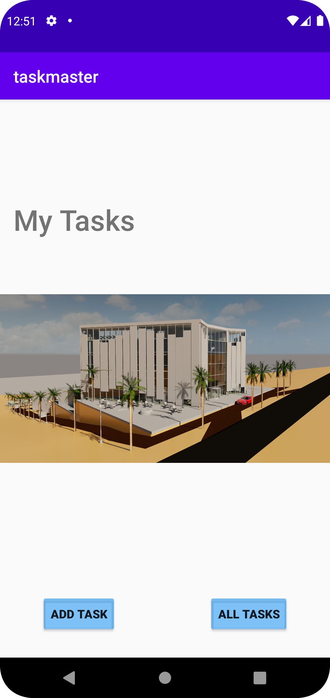
Pages other than the home page have a back home arrow in the header.

## Version 2 : lab 27 - Data in TaskMaster

In this lab I learnt how to deal with data , I added four buttons for the home page :
- Three buttons for hard coded tasks leading me to taskDetails activity.
  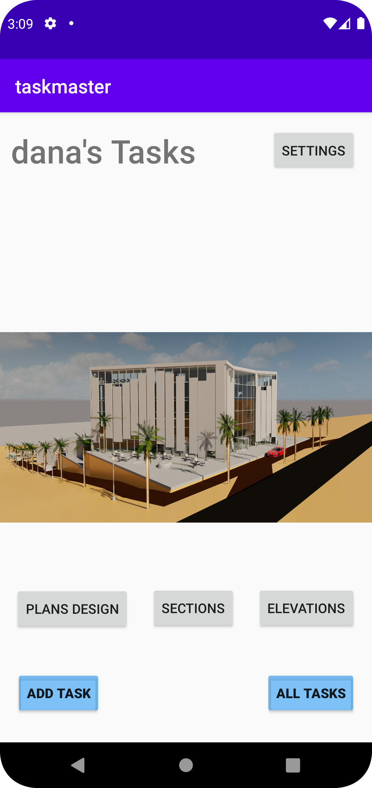
  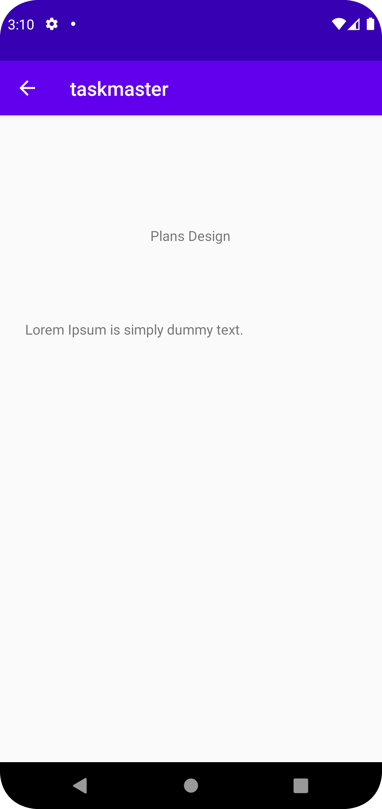

- Button number four takes me to the settings activity where you can set your username and you will have your username rendered on the home page.
  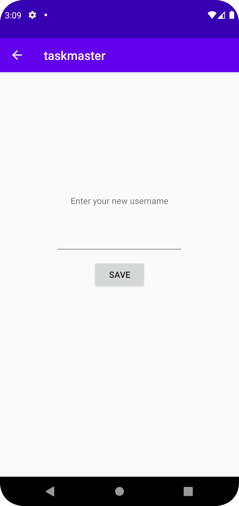

## Version 3 : lab 28 - RecyclerView 

In this lab I learnt how to display a recyclerView and send its data to the next activity. 
For this lab I created a task class, deleted my three tasks buttons and created a recyclerView instead that sends all the task data to the taskDetails activity.
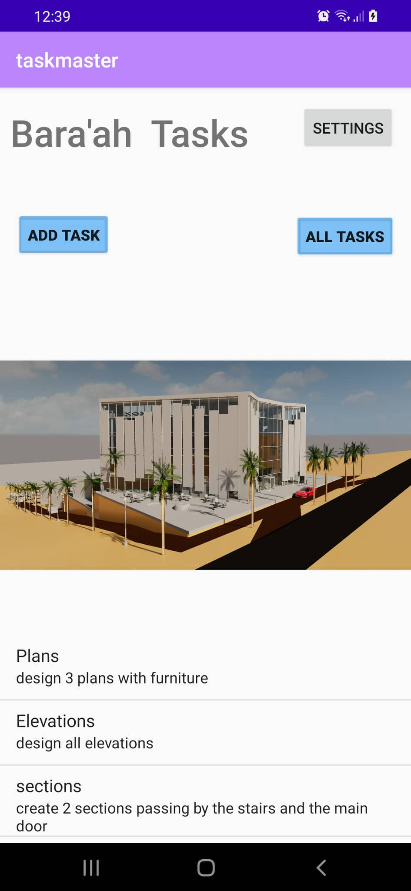
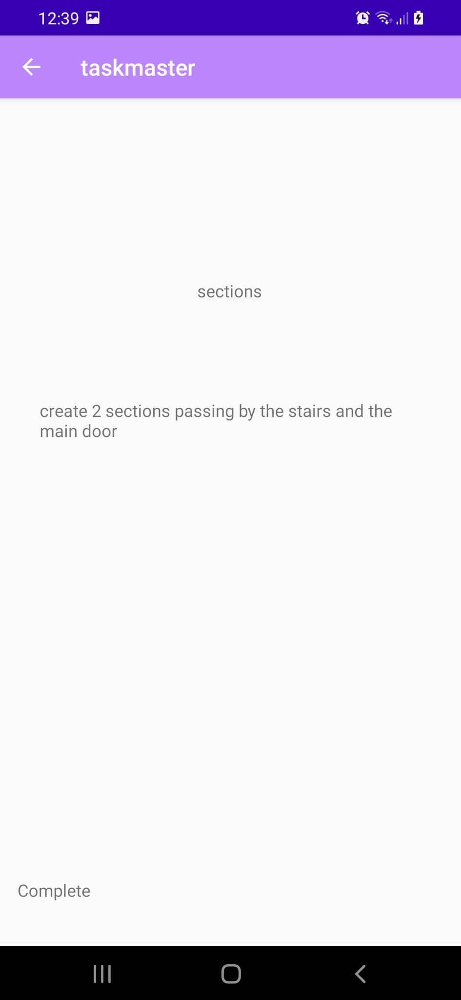
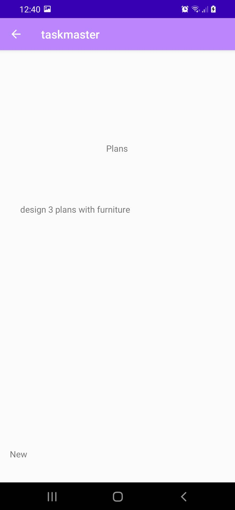

In addition to that I added a spinner in the addTask activity for setting the task state.
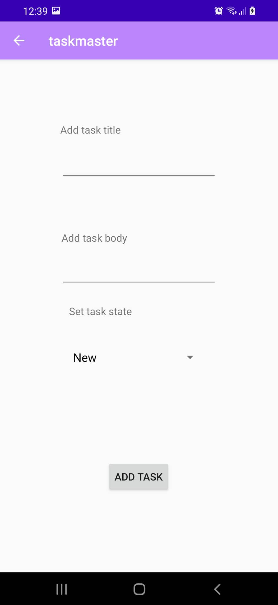
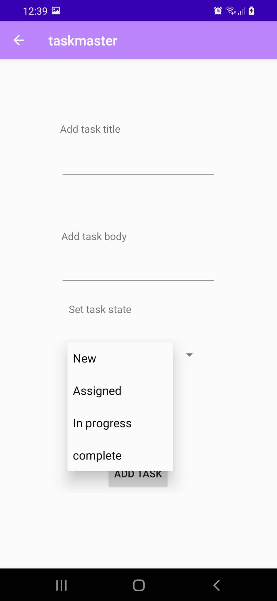

## Version 4 : lab 29 - Room 
For this lab I learnt how to create a database with Room and how to add an entity to it and how to deal with them using DAO.  
In this version I created a database for my application so now I am able to take tasks from the user.
In addition to that I rendered these tasks from the database to the main activity page and I am able to send each task's data to te task details activity. 
Nothing changed visually so no need for screenshots for this version. 

## Version 5 : lab 31 - Espresso and Polish

For this lab I added UI tests for :
- Navigating to settings activity and changing the username 
- Rendering the username in the main activity 
- Navigating to add tasks activity and adding a task. 
  Nothing changed visually so no need for screenshots for this version. 
  
## Version 6 : lab 32 - Amplify and DynamoDB

In this lab I created an AWS account and installed the Amplify CLI and connected my application with amplify and DynamoDB to save my data in instead of Room.

## Version 7 : lab 33 - Related Data

For this lab I Created a second entity for a team, which has a name and a list of tasks. Updated my tasks to be owned by a team.
In the settings activity the user can specify the team he/she belongs to.  
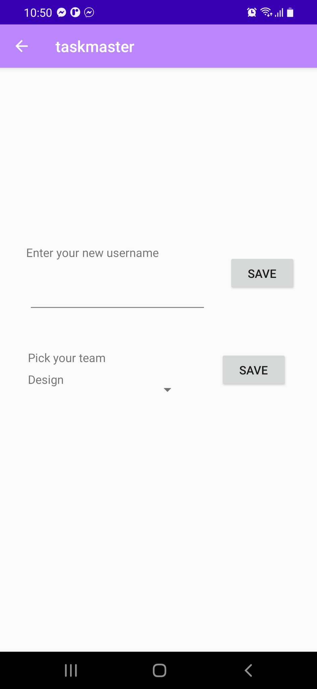  
So, in the main activity they will see only tasks that belong to their team. 
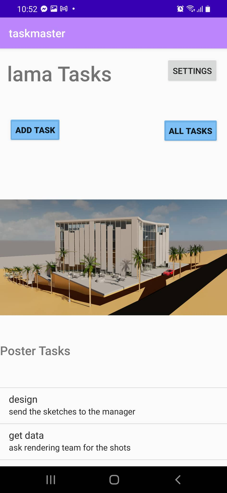  
In the addTask activity the user now have to specify what team the added task belongs to .   
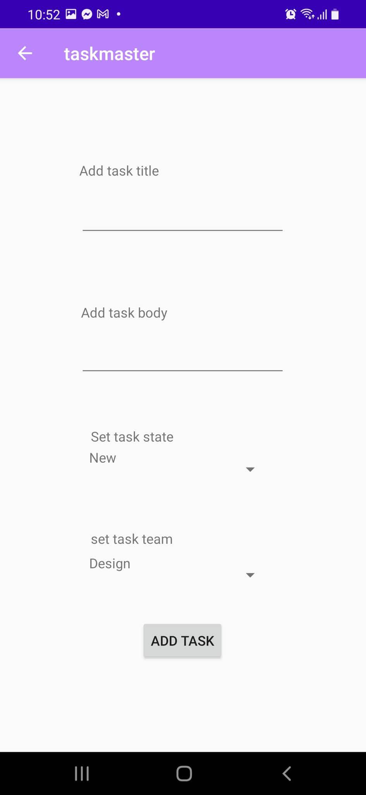 

## Version 8 : lab 36 - Cognito

In this lab I allowed users to sign up , log in and log out using Cognito.
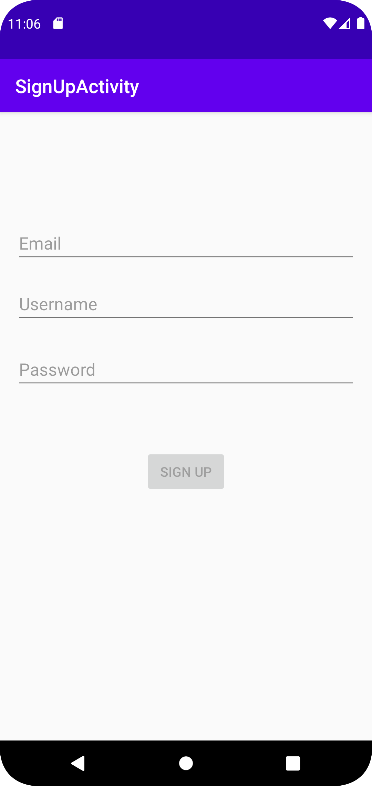
After signing up the user will receive a verification code to his email and will be navigated to verification page.  
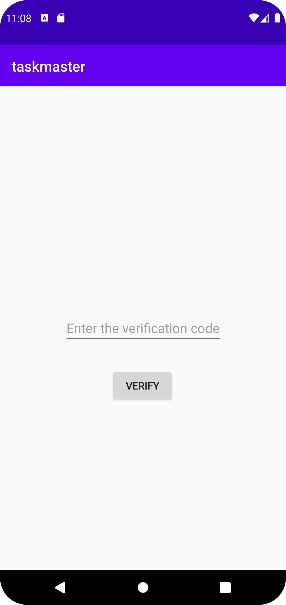

After verifying the email address the user will be navigated to the sign in page to sign in using their username and password.
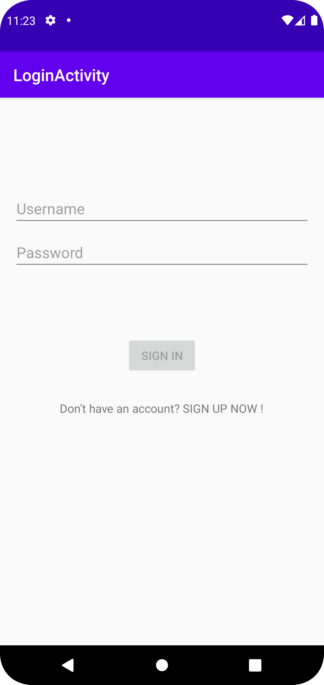
I also added Log out button in the menu in the navigation bar .
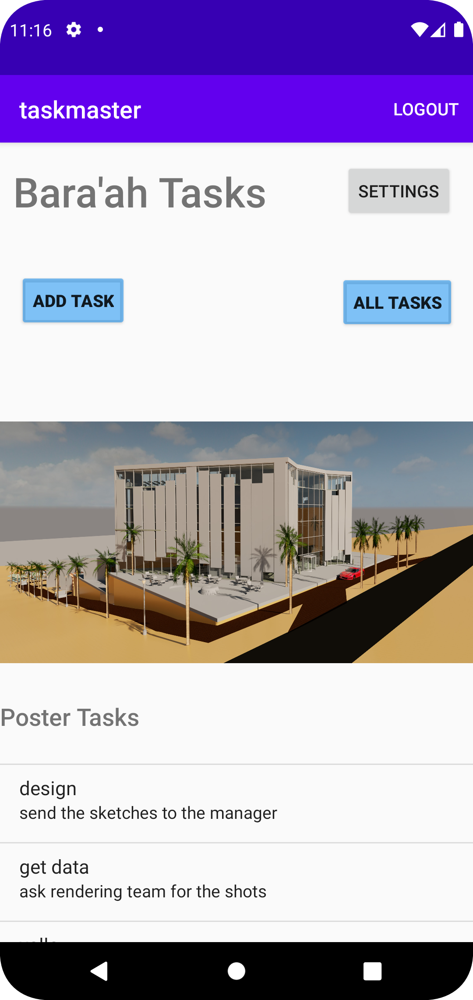